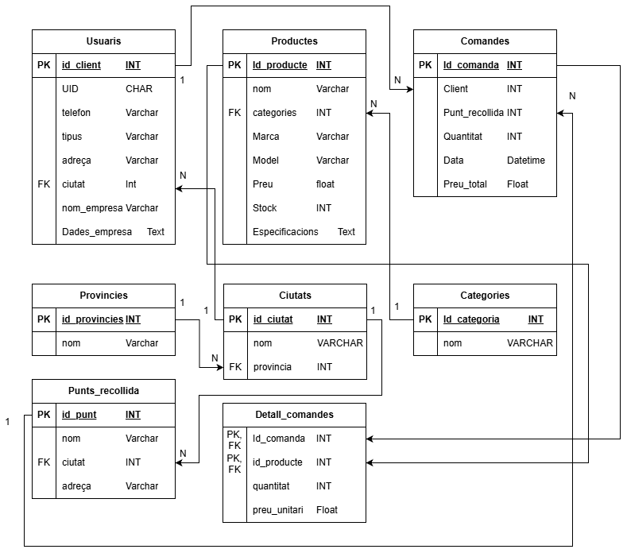

# Repia

## Resum

## Base de dades

**Usuaris:** Emmagatzema la informació dels usuaris de l'aplicació. Separar usuaris permet gestionar clients individuals i empreses, així com reutilitzar la seva informació en comandes.

**Productes:** Emmagatzema els productes del sistema. Permet gestionar inventari, categorització i informació detallada dels productes.

**Comandes:** Registra les comandes realitzades pels clients. Permet traçar la activitat dels clients.

**Detall_comandes:** Cada comanda en productes concrets.
 
**Categories:** Classificació dels productes. Facilita la classificació i cerca de productes.

**Ciutats:** Conté les ciutats.

**Províncies:** Conté las provincias.

**Punts_recollida:** Llocs on es poden recollir les comandes.

**Justificacions i Relacions**
*Usuaris a Comandes (1:N)*
Un usuari pot fer moltes comandes.
Cada comanda pertany a un únic usuari.

*Comandes a Detall_comandes (1:N)*
Una comanda té diversos productes.

*Productes a Detall_comandes (1:N)*
Un producte pot aparèixer en moltes comandes.

*Productes a Categories (N:1)*
Molts productes poden pertànyer a una categoria.

*Ciutats a Províncies (N:1)*
Una ciutat pertany a una província.

*Usuaris a Ciutats (N:1)*
Cada usuari viu en una ciutat.

*Punts_recollida a Ciutats (N:1)*
Cada punt està en una ciutat.

*Comandes a Punts_recollida (N:1)*
Cada comanda es recull en un punt concret.

